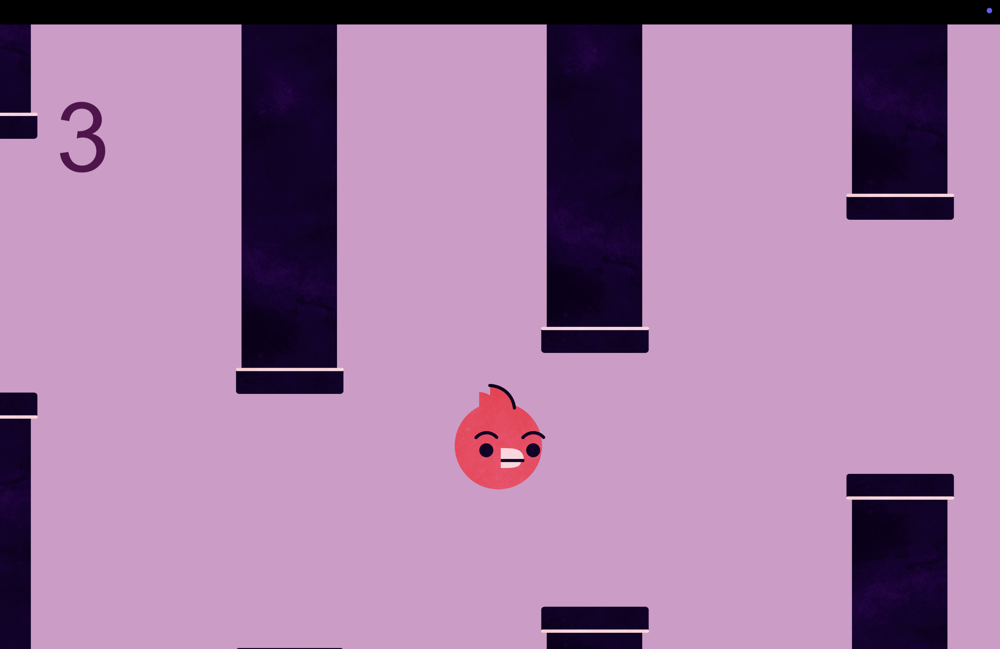
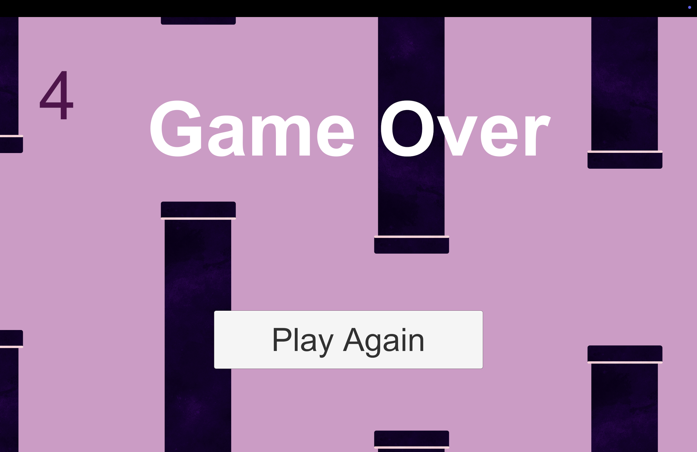

This game is inspired by the classic Flappy Bird and developed using Unity.

The objective is simple:
Guide the bird character through the gaps between the pipes.
The game ends when the bird collides with a pipe or goes off-screen.

## 🖼️ Screenshots

### Gameplay

### Game Over

